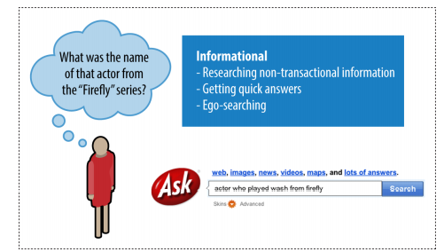
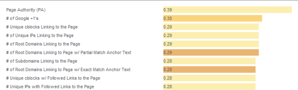
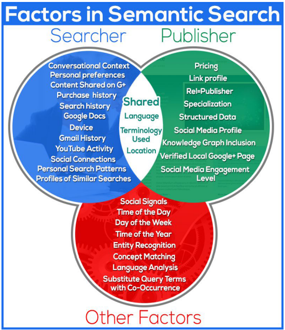
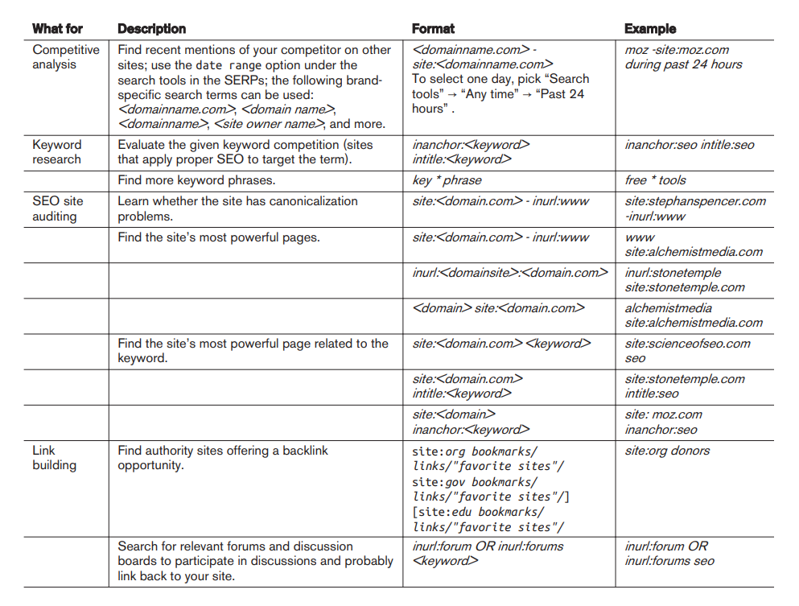

# Determining Searcher Intent: A Challenge for Search Marketers and Search Engines

### Navigational Queries

Users perform navigational searches with the intent of going directly to a specific website. In some cases, the user may not know the exact URL, and the search engine serves as the “White Pages.”

Opportunities: Pull searcher away from destination; get ancillary or investigatory traffic.

Informational Queries :  Very high when searches are for the publisher’s own brand. These types of searches tend to lead to very high conversion rates

### Informational Queries

Very high when searches are for the publisher’s own brand. These types of searches tend to lead to very high conversion rates Informational searches are primarily non-transaction-oriented (although they can include researching information about a product or service); the information itself is the goal, and no interaction beyond clicking and reading is required for the searcher’s query to be satisfied

Opportunities: Brand searchers with positive impressions of your site, information, company, and so on; attract inbound links; receive attention from journalists/researchers;
potentially convert to sign up or purchase.
Average traffic value: The searcher may not be ready to buy anything just yet, or may not even have a long-term intent to buy anything, so the value tends to be “medium” at best. However, many of these searchers will later enter in a more targeted search, and this represents an opportunity to capture mindshare with those potential customers. For example, informational queries that are focused on researching commercial products or services can have high value.

### Transactional Queries

ransactional searches don’t necessarily have to involve a credit card or immediate
financial transaction. Creating a Pinterest account, signing up for a free trial account at DomainTools, or finding the best local Japanese restaurant for dinner tonight are all transactional queries. Figure 1-4 shows an example of a transactional query.

Opportunities: Achieve transaction (financial or other).

Average traffic value: Very high.
esearch from Pennsylvania State University and the Queensland University of Technology shows that more than 80% of searches are informational in nature,  and only about 10% of searches are navigational or transactional

### Adaptive Search
ormally, a search on hotels would not include results for hotels in Rome, but when
the preceding query was for Rome, some results for hotels in Rome will be included. Keeping track of users’ previous search queries and taking them into account when determining which results to return for a new query—known as adaptive search—is intended to help the search engines get a better sense of a user’s intent. The search engines need to do this with care: excessive changes to the results they return based

### Searcher Intent

This type of analysis can help you determine where to place ads and where to concentrate content and links.

One problem in search is that when most searchers formulate their search queries,
their input is limited to just a handful of words (generally one to four). Because most people don’t have a keen understanding of how search engines work, they often provide queries that are too general or that are presented in a way that does not provide the search engine (or the marketer) with what it needs to determine, with 100% accuracy 100% of the time, their specific intent. Additionally, search engine users may not have a specific intent for an individual search query beyond “curiosity” about a general trending topic, or subject matter. While this poses potential difficulty in delivering relevant results, it also poses great opportunity to capture the mind of someone

These types of general queries are important to most businesses because they often get the brand and site on the searcher’s radar, and this initiates the process of building trust with the user. Over time, the user will move on to more specific searches that are more transactional or navigational in nature.

## Document Analysis and Semantic Connectivity

In document analysis, search engines look at whether they find the search terms in
important areas of the document—the title, the metadata, the heading tags, and the
body of the text. They also attempt to automatically measure the quality of the document based on document analysis, as well as many other factors.4

Reliance on document analysis alone is not enough for today’s search engines, so they also look at semantic connectivity. Semantic connectivity refers to words or phrases that are commonly associated with one another. For example, if you see the word aloha you associate it with Hawaii, not Florida. Search engines actively build their own thesaurus and dictionary to help them determine how certain terms and topics are related. By simply scanning their massive databases of content on the Web, they can use fuzzy set theory and certain equations to connect terms and start to understand web pages and sites more like a human does.

- Measuring which keyword phrases to target
- Measuring which keyword phrases to include on a page about a certain topic
- Measuring the relationships of text on other high-ranking sites and pages
- Finding pages that provide “relevant” themed links

### Content Quality and User Engagement

Search engines also attempt to measure the quality and uniqueness of a website’s content. One method they may use for doing this is evaluating the document itself. For example, if a web page has lots of spelling and grammatical errors, that can be taken as a sign that little editorial effort was put into that page.

### Interaction with web search results

Search engines also attempt to measure the quality and uniqueness of a website’s content. One method they may use for doing this is evaluating the document itself. For example, if a web page has lots of spelling and grammatical errors, that can be taken as a sign that little editorial effort was put into that page.5

### Google Analytics

Bounce rate
The percentage of visitors who visit only one page on your website

## Link Analysis

Link analysis goes much deeper than counting the number of links a web page or website has, as all links are not created equal (one link can be worth 10 million times more than another one). Links from a highly authoritative page on a highly authoritative site will count more than other links of lesser authority. A search engine can determine a website or page to be authoritative by combining an analysis of the linking patterns and semantic analysis.

The degree to which search engines rely on evaluating link neighborhoods is not clear, and links from irrelevant pages can still help the rankings of the target pages. Nonetheless, the basic idea remains that a link from a relevant page or site should be more valuable than a link from a nonrelevant page or site.
Another factor in determining the value of a link is the way the link is implemented and where it is placed. For example, the text used in the link itself (i.e., the actual text that will go to your web page when the user clicks on it) is also a strong signal to the search engines.

### Evaluating Social Media Signals

### What is semantic search?
The word "semantic" refers to the meaning or essence of something. Applied to search, "semantics" essentially relates to the study of words and their logic. Semantic search seeks to improve search accuracy by understanding a searcher’s intent through contextual meaning. Through concept matching, synonyms, and natural language algorithms, semantic search provides more interactive search results through transforming structured and unstructured data into an intuitive and responsive database. Semantic search brings about an enhanced understanding of searcher intent, the ability to extract answers, and delivers more personalized results. Google’s Knowledge Graph is a paradigm of proficiency in semantic search.

# Analyzing Ranking Factors

- Domain-level link authority features
- Page-level link metrics
- Page-level keywords and content
- Page-level keyword-agnostic features
- Domain-level brand metrics
- Usage and traffic/query data
- Page-level social metrics
- Domain-level keyword usage
- Domain-level keyword-agnostic features

Domain-level link authority features
Domain-level link authority is based on a cumulative link analysis of all the links to the domain. This includes factors such as the number of different domains linking to the site, the trust/authority of those domains, the rate at which new inbound links are added, the relevance of the linking domains, and more.

Page-level link metrics
This refers to the links as related to the specific page, such as the number of links, the relevance of the links, and the trust and authority of the links received by the page.

Page-level keywords and content
This describes the use of the keyword term/phrase in particular parts of the HTML
code on the page (<title> tag, <h1>, alt attributes, etc.).

Page-level features other than keywords
Factors included here are page elements such as the number of links on the page,
number of internal links, number of followed links, number of “nofollow” links,
and other similar factors.

Domain-level brand metrics
This factor includes search volume on the website’s brand name, mentions,
whether it has a presence in social media, and other brand-related metrics.

Page-level traffic/query data
Elements of this factor are click-through rate to the page in the search results,
bounce rate of visitors to the page, and other similar measurements.

Page-level social metrics
Social metrics considered include mentions, links, shares, likes, and other social
media site–based metrics. It should be emphasized that many SEO practitioners
believe that this is a ranking factor even though studies have since shown otherwise, and representatives from Google clearly state that social signals are not part of their algorithm.

Domain-level keyword usage
This refers to how keywords are used in the root or subdomain name, and how
impactful that might be on search engine rankings.

Domain-level keyword usage
This refers to how keywords are used in the root or subdomain name, and how
impactful that might be on search engine rankings.

# Negative Ranking Factors

Malware being hosted on the site
The search engines will act rapidly to penalize sites that contain viruses or Trojans.

Cloaking
Search engines want publishers to show the same content to the search engine as
is shown to users.

Pages on the sites with links for sale
Google has a strong policy against paid links, and sites that sell links may be
penalized.

Content that advertises paid links on the site
As an extension of the prior negative ranking factor, promoting the sale of paid
links may be a negative ranking factor.

Page speed
Back in 2010, Google’s Matt Cutts announced that Google was making page speed
a ranking factor. In general, it is believed that this is a negative factor for pages that are exceptionally slow.

# Google Search technique 

## Determining keyword difficulty

When you are building a web page, it can be useful to know how competitive the keyword is that you are going after, yet this information can be difficult to obtain. However, there are steps you can take to get some idea of how difficult it is to rank for a keyword. For example, the intitle: operator shows pages that are more focused on your search term than the pages returned without that operator (e.g., intitle:"dress boots”).
You can use different ratios to give you a sense of how competitive a keyword market is (higher results mean that it is more competitive). For example:
- dress boots (108,000,000) versus “dress boots” (2,020,000) versus intitle:"dress boots”
(375,000)
- Ratio: 108,000/375 = 290:1
- Exact phrase ratio: 2,020/37 = 5.4:1

## Uncovering subscriber-only or deleted content

Uncovering subscriber-only or deleted conten
If no Cached link is available, use Google Translate to take your English document and

translate it from Spanish to English (this will reveal the content even though no
Cached link is available):

https://translate.google.com/?hl=en&sl=es&tl=en

## Identifying neighborhoods

The related: operator will look at the sites linking (the linking sites) to the specified site, and then see which other sites are commonly linked to by the linking sites. These are commonly referred to as neighborhoods, as there is clearly a strong relationship between
sites that share similar link graphs.

# SEO Planning: Customizing Your Strategy

- What the organization is trying to promote (service, product, content)
- Who the target market is (can be as simple as “women” or as detailed as personas)
- Brand (includes copy and messaging)
- Website structure (includes site architecture, navigational elements, and file/URL naming conventions)
- Current site content assets (includes images, videos, PDF files, white papers, case studies, articles)
- Ease with which the content and site structure can be modified (involves the CMS and web development teams)
- Editorial resources and calendar for content development (what content is developed, by whom, and on what timeline)
- Competitive landscape

