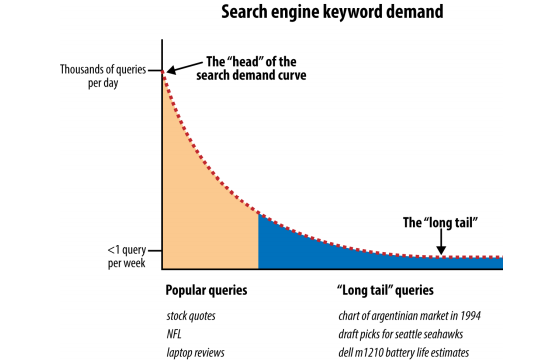

# Determining Searcher Intent: A Challenge for Search Marketers and Search Engines

### Navigational Queries

Users perform navigational searches with the intent of going directly to a specific website. In some cases, the user may not know the exact URL, and the search engine serves as the “White Pages.”

Opportunities: Pull searcher away from destination; get ancillary or investigatory traffic.

Informational Queries :  Very high when searches are for the publisher’s own brand. These types of searches tend to lead to very high conversion rates

### Informational Queries

Very high when searches are for the publisher’s own brand. These types of searches tend to lead to very high conversion rates Informational searches are primarily non-transaction-oriented (although they can include researching information about a product or service); the information itself is the goal, and no interaction beyond clicking and reading is required for the searcher’s query to be satisfied

Opportunities: Brand searchers with positive impressions of your site, information, company, and so on; attract inbound links; receive attention from journalists/researchers;
potentially convert to sign up or purchase.
Average traffic value: The searcher may not be ready to buy anything just yet, or may not even have a long-term intent to buy anything, so the value tends to be “medium” at best. However, many of these searchers will later enter in a more targeted search, and this represents an opportunity to capture mindshare with those potential customers. For example, informational queries that are focused on researching commercial products or services can have high value.

### Transactional Queries

ransactional searches don’t necessarily have to involve a credit card or immediate
financial transaction. Creating a Pinterest account, signing up for a free trial account at DomainTools, or finding the best local Japanese restaurant for dinner tonight are all transactional queries. Figure 1-4 shows an example of a transactional query.

Opportunities: Achieve transaction (financial or other).

Average traffic value: Very high.
esearch from Pennsylvania State University and the Queensland University of Technology shows that more than 80% of searches are informational in nature,  and only about 10% of searches are navigational or transactional

### Adaptive Search
ormally, a search on hotels would not include results for hotels in Rome, but when
the preceding query was for Rome, some results for hotels in Rome will be included. Keeping track of users’ previous search queries and taking them into account when determining which results to return for a new query—known as adaptive search—is intended to help the search engines get a better sense of a user’s intent. The search engines need to do this with care: excessive changes to the results they return based

### Searcher Intent

This type of analysis can help you determine where to place ads and where to concentrate content and links.

One problem in search is that when most searchers formulate their search queries,
their input is limited to just a handful of words (generally one to four). Because most people don’t have a keen understanding of how search engines work, they often provide queries that are too general or that are presented in a way that does not provide the search engine (or the marketer) with what it needs to determine, with 100% accuracy 100% of the time, their specific intent. Additionally, search engine users may not have a specific intent for an individual search query beyond “curiosity” about a general trending topic, or subject matter. While this poses potential difficulty in delivering relevant results, it also poses great opportunity to capture the mind of someone

These types of general queries are important to most businesses because they often get the brand and site on the searcher’s radar, and this initiates the process of building trust with the user. Over time, the user will move on to more specific searches that are more transactional or navigational in nature.

## Document Analysis and Semantic Connectivity

In document analysis, search engines look at whether they find the search terms in
important areas of the document—the title, the metadata, the heading tags, and the
body of the text. They also attempt to automatically measure the quality of the document based on document analysis, as well as many other factors.4

Reliance on document analysis alone is not enough for today’s search engines, so they also look at semantic connectivity. Semantic connectivity refers to words or phrases that are commonly associated with one another. For example, if you see the word aloha you associate it with Hawaii, not Florida. Search engines actively build their own thesaurus and dictionary to help them determine how certain terms and topics are related. By simply scanning their massive databases of content on the Web, they can use fuzzy set theory and certain equations to connect terms and start to understand web pages and sites more like a human does.

- Measuring which keyword phrases to target
- Measuring which keyword phrases to include on a page about a certain topic
- Measuring the relationships of text on other high-ranking sites and pages
- Finding pages that provide “relevant” themed links

### Content Quality and User Engagement

Search engines also attempt to measure the quality and uniqueness of a website’s content. One method they may use for doing this is evaluating the document itself. For example, if a web page has lots of spelling and grammatical errors, that can be taken as a sign that little editorial effort was put into that page.

### Interaction with web search results

Search engines also attempt to measure the quality and uniqueness of a website’s content. One method they may use for doing this is evaluating the document itself. For example, if a web page has lots of spelling and grammatical errors, that can be taken as a sign that little editorial effort was put into that page.5

### Google Analytics

Bounce rate
The percentage of visitors who visit only one page on your website

## Link Analysis

Link analysis goes much deeper than counting the number of links a web page or website has, as all links are not created equal (one link can be worth 10 million times more than another one). Links from a highly authoritative page on a highly authoritative site will count more than other links of lesser authority. A search engine can determine a website or page to be authoritative by combining an analysis of the linking patterns and semantic analysis.

The degree to which search engines rely on evaluating link neighborhoods is not clear, and links from irrelevant pages can still help the rankings of the target pages. Nonetheless, the basic idea remains that a link from a relevant page or site should be more valuable than a link from a nonrelevant page or site.
Another factor in determining the value of a link is the way the link is implemented and where it is placed. For example, the text used in the link itself (i.e., the actual text that will go to your web page when the user clicks on it) is also a strong signal to the search engines.

### Evaluating Social Media Signals

### What is semantic search?
The word "semantic" refers to the meaning or essence of something. Applied to search, "semantics" essentially relates to the study of words and their logic. Semantic search seeks to improve search accuracy by understanding a searcher’s intent through contextual meaning. Through concept matching, synonyms, and natural language algorithms, semantic search provides more interactive search results through transforming structured and unstructured data into an intuitive and responsive database. Semantic search brings about an enhanced understanding of searcher intent, the ability to extract answers, and delivers more personalized results. Google’s Knowledge Graph is a paradigm of proficiency in semantic search.

# Ranking
## Analyzing Ranking Factors

- Domain-level link authority features
- Page-level link metrics
- Page-level keywords and content
- Page-level keyword-agnostic features
- Domain-level brand metrics
- Usage and traffic/query data
- Page-level social metrics
- Domain-level keyword usage
- Domain-level keyword-agnostic features

Domain-level link authority features
Domain-level link authority is based on a cumulative link analysis of all the links to the domain. This includes factors such as the number of different domains linking to the site, the trust/authority of those domains, the rate at which new inbound links are added, the relevance of the linking domains, and more.

Page-level link metrics
This refers to the links as related to the specific page, such as the number of links, the relevance of the links, and the trust and authority of the links received by the page.

Page-level keywords and content
This describes the use of the keyword term/phrase in particular parts of the HTML
code on the page (<title> tag, <h1>, alt attributes, etc.).

Page-level features other than keywords
Factors included here are page elements such as the number of links on the page,
number of internal links, number of followed links, number of “nofollow” links,
and other similar factors.

Domain-level brand metrics
This factor includes search volume on the website’s brand name, mentions,
whether it has a presence in social media, and other brand-related metrics.

Page-level traffic/query data
Elements of this factor are click-through rate to the page in the search results,
bounce rate of visitors to the page, and other similar measurements.

Page-level social metrics
Social metrics considered include mentions, links, shares, likes, and other social
media site–based metrics. It should be emphasized that many SEO practitioners
believe that this is a ranking factor even though studies have since shown otherwise, and representatives from Google clearly state that social signals are not part of their algorithm.

Domain-level keyword usage
This refers to how keywords are used in the root or subdomain name, and how
impactful that might be on search engine rankings.

Domain-level keyword usage
This refers to how keywords are used in the root or subdomain name, and how
impactful that might be on search engine rankings.

## Negative Ranking Factors

Malware being hosted on the site
The search engines will act rapidly to penalize sites that contain viruses or Trojans.

Cloaking
Search engines want publishers to show the same content to the search engine as
is shown to users.

Pages on the sites with links for sale
Google has a strong policy against paid links, and sites that sell links may be
penalized.

Content that advertises paid links on the site
As an extension of the prior negative ranking factor, promoting the sale of paid
links may be a negative ranking factor.

Page speed
Back in 2010, Google’s Matt Cutts announced that Google was making page speed
a ranking factor. In general, it is believed that this is a negative factor for pages that are exceptionally slow.

## Google Search technique 

### Determining keyword difficulty

When you are building a web page, it can be useful to know how competitive the keyword is that you are going after, yet this information can be difficult to obtain. However, there are steps you can take to get some idea of how difficult it is to rank for a keyword. For example, the intitle: operator shows pages that are more focused on your search term than the pages returned without that operator (e.g., intitle:"dress boots”).
You can use different ratios to give you a sense of how competitive a keyword market is (higher results mean that it is more competitive). For example:
- dress boots (108,000,000) versus “dress boots” (2,020,000) versus intitle:"dress boots”(375,000)
- Ratio: 108,000/375 = 290:1
- Exact phrase ratio: 2,020/37 = 5.4:1

### Uncovering subscriber-only or deleted content

Uncovering subscriber-only or deleted conten
If no Cached link is available, use Google Translate to take your English document and

translate it from Spanish to English (this will reveal the content even though no
Cached link is available):

https://translate.google.com/?hl=en&sl=es&tl=en

### Identifying neighborhoods

The related: operator will look at the sites linking (the linking sites) to the specified site, and then see which other sites are commonly linked to by the linking sites. These are commonly referred to as neighborhoods, as there is clearly a strong relationship between
sites that share similar link graphs.

# SEO Planning: Customizing Your Strategy

- What the organization is trying to promote (service, product, content)
- Who the target market is (can be as simple as “women” or as detailed as personas)
- Brand (includes copy and messaging)
- Website structure (includes site architecture, navigational elements, and file/URL naming conventions)
- Current site content assets (includes images, videos, PDF files, white papers, case studies, articles)
- Ease with which the content and site structure can be modified (involves the CMS and web development teams)
- Editorial resources and calendar for content development (what content is developed, by whom, and on what timeline)
- Competitive landscape

## Business Factors That Impact Your SEO Strategy

Revenue and business models
The effective SEO strategy takes into account the purpose of the site—whether it
is to sell products, sell advertising, obtain leads, or gain membership signups. 

Target customers
Who are you trying to reach? This could be an age group, a gender group, or as
specific as people looking to buy a house within a specific neighborhood

Competitors
The competitive landscape is another big factor in your overall strategy. Competition may be strongly etrenched in one portion of the market online, and it may make sense to focus on a different segment

Branding goals
There may be search terms for which it is critical that you have top search exposure, for branding reasons.

Content development
An important part of SEO and general online success is the creation and optimization of high-quality content for your users. For most businesses, your capacity tocreate quality content on an ongoing basis can significantly improve your SEO efforts, both from a content-availability perspective (more content in the search engines) and from a user engagement and link development perspective (great content breeds great links and social sharing, both of which can positively influence SEO

How people search for products like yours
Understanding what customers do when they are searching for products or services like yours is one of the most basic functions of SEO

- The competitor discovers a unique, highly converting set of keywords.
- The competitor discovers a targeted, high-value link from an authoritative  ource.
- The competitor saturates a market segment, justifying your focus elsewhere.
- Weaknesses appear in the competitor’s strategy, which provide opportunities for exploitation.

## SWOT Analysis

- What sources of traffic are working well (converting on established site goals) for your site/business?
- Which projects/properties/partnerships are driving positive momentum toward traffic/revenue goals?
- Which of your content sections/types produces high traffic, conversions, and ROI?
- What changes have you made historically that produced significant value?

Determining the weaknesses can be tougher (and requires emotional separation from
the data):

- What content is currently driving low levels of search/visitor traffic?
- Which changes that were intended to produce positive results have shown little or no value?
- Which traffic sources are underperforming or underdelivering?
- What projects/properties/partnerships are being leveraged poorly, or not at all?

Parsing opportunities requires a combination of strength and weakness analysis. You want to find areas that are doing well but have room to expand, as well as those that have yet to be explored:

- What brainstormed but undeveloped or untested projects/ideas can have a significant, positive impact?
- What traffic sources currently sending good-quality traffic could be expanded to provide more value?
- What areas of weakness have direct paths to recovery?
- Which website changes have had positive results? Can these be applied more rigorously or to other areas for increased benefit?
- What new markets or new content areas are potentially viable or valuable for expansion?
- What sources of new content or new links have yet to be tapped?
- What third-party platforms (social media, content curators, etc.) can be utilized to expand reach and increase engagement?

Determining threats can be the most challenging of the tasks. You’ll need to combine

creative thinking with an honest assessment of your weaknesses and your competitors’ strengths, and consider the possibilities of macro-events that could shape your
website/company’s future:

- In your areas of weakness, which players in your market (or other, similar markets) are strong? How have they accomplished this?
- What shifts in human behavior, web usage, or market conditions could dramatically impact your business/site? (For example, consider the “what if people stopped searching and instead navigated the Web in different ways?” perspective. It is a bit “pie in the sky,” but we have already seen Craigslist make classifieds obsolete, and have witnessed Facebook start to take advertising market share from the search engines.)
- Which competitors have had the most success in your arena? How have they accomplished this? Where do they intersect with your business/customers?
- Are there any strategies implemented by startups in similar businesses that have had massive success in a particular arena that could be dangerous to your business if they were replicated in your market?

Conducting SWOT analysis from a web marketing and SEO perspective is certainly one
of the most valuable first steps you can take as an organization poised to expend
resources. If you haven’t taken the time to analyze the landscape from these bird’seye-view perspectives, you might end up like a great runner who’s simply gone off the course—sure, you’ll finish fast, but where will it take you?

## SMART Objectives

Specific objectives are important. It is easy to get caught up in the details of the plan and lose sight of the broader site objectives. You may think you want to rank #1 for this phrase or that, but in reality what you want is more granular than that: more leads, more page views, more customers. Perhaps you don’t even need more customers from organic search, but you want higher sales volumes, so in fact having the same number of orders but with a higher average order value would meet your objectives better.

Measurable objectives are essential if you are to manage the performance in meeting them—you can’t manage what you can’t measure. SEO practitioners have to help their clients or organizations come to grips with analytics, and not just the analytics software, but the actual processes of how to gather the data, how to sort it, and most importantly, how to use it to make informed decisions.

Achievable objectives are ones that can be accomplished with the available resources.
You could decide to put a man on Mars next year, for example, but it is just too big an undertaking to be feasible. You can be ambitious, but it is important to pick goals that can be met. You cannot possibly sell to more people than exist in your market. There are limits to markets, and at a certain point the only growth can come from opening new markets, or developing new products for the existing market.

Realistic objectives are about context and resources. It may be perfectly achievable to meet a certain objective, but only with greater resources than may be presently available. Even a top ranking on the most competitive terms around is achievable for a relevant product, but it is a realistic goal only if the resources required for such an effort are available.

Timelined objectives are the final part of the SMART methodology. If there is no timeline, no project can ever fail, because it can’t run out of time. SEO generally tends to take longer to implement and gather momentum than a paid search advertising campaign. It is important that you set milestones and deadlines so that you can manage expectations and course-correct.

EX: 

“We want to rank at #1 for loans” is not a SMART objective. It doesn’t identify the specific reason why the company thinks a #1 ranking will help it. It doesn’t have a timeline, so there is no way to fail. It doesn’t state an engine on which to be #1, s there’s a guaranteed argument if the intention is to rank well on both Google and Bing, but the result is only high rankings on Bing.
“We want to increase approved loan applications generated by organic search by 30%
over six months” is a far better objective. There is a deadline, and the company can certainly gauge progress toward the specific objective. The company can look at its current market share and the resources committed to see whether this is an achievable and realistic goal.

# SEO Implementation: First Stages

- Target keywords
- Cross-link relevant content (ex:“Frequently Bought Together” )
- Use anchor text, intuitively (instead click here in anchor, Use anchor text, intuitively)
- Use breadcrumb navigation
- Minimize link depth

### Single-Page Applications

Server rendering versus client-Only rendering.
If the website owner doesn’t care about achieving top ranking, and the only goal  is getting indexed—and, the only goal is to get indexed by Google, not any other search engine—then it is OK to do clientonly rendering with Angular. Google has gotten very good recently at indexing client rendered HTML. If you go down this route, you will need to do the following:

1. Enable push state in Angular so you get pretty URLs without the hash.
2. Implement UI Router or the new Component Router in Angular so you can map URLs to pages.
3. Follow all normal SEO best practices for page titles, URLs, content, etc. Nothing changes here.
4. Optimize the heck out of the initial page load—a major mistake many make is thinking initial page load time for client-rendered apps doesn’t matter, but it does!

While the above approach will work for Google indexing, you will perform better in
organic search with server rendering. The reasons for this are:

The options for server rendering are as follows:
- Implement in PHP or another language. This will work but requires that you duplicate all pages, which is generally not feasible unless you have a small/simple site.
- Use Prerender.io or a similar service. This works but can get expensive for larger ites, can be tricky to set up, and you need to be OK with long page cache times (i.e., server pages are one day old).
- Build a custom solution off the Jangular library. Although this works, it does require a lot of heavy lifting.

# Auditing an Existing Site to Identify SEO Problems

1. Check SEO FROG

2. Page load time
3. Mobile-friendliness
4. Usability
5. Accessibility/spiderability
6. Search engine health checks

- Perform a site:<yourdomain.com> search in the search engines to check how many of your pages appear to be in the index. Compare this to the number of unique pages you believe you have on your site. Also, check indexation numbers in your Google Search Console and Bing Webmaster Tools accounts.
- Check the Google cache to make sure the cached versions of your pages look the same as the live versions.
- Check to ensure major search engine Search Console and Webmaster Tools accounts have been verified for the domain (and any subdomains, for mobile or other content areas). Google and Bing currently offer site owner validation to “peek” under the hood of how the engines view your site.
- Test a search on your brand terms to make sure you are ranking for them (if not, you may be suffering from a penalty; be sure to check your associated Search Console/Webmaster Tools accounts to see if there are any identifiable penalties,  r any other helpful information).

7. Keyword health checks

8. Duplicate content checks

The first thing you should do is make sure the non-www versions of your pages (i.e., http://yourdomain.com) 301-redirect to the www versions (i.e., http://www.yourdomain.com), or vice versa (this is often called the canonical redirect

You can also use search operators such as inurl: and intitle: (refer back to Table 2-1 for a refresher) to check for duplicate content. For example, if you have URLs for pages that have distinctive components to them

9. URL checks Make sure you have clean, short, descriptive URLs

10. HTML <title> tag review

Make sure the <title> tag on each page of the site is unique and descriptive. If you want to include your company brand name in the title, consider putting it at the end of the <title> tag, not at the beginning, as placing keywords at the front of a page title (generally referred to as prominence) brings ranking benefits. Also check to ensure the <title> tag is fewer than 70 characters long, or 512 pixels wide.

11. Content review

12. Meta tag review

13. Sitemaps file and robots.txt file verification

14. URL redirect checks
Use a server header checker such as Redirect Check or RedirectChecker.org

15. Internal linking checks

16. Avoidance of unnecessary subdomains

The engines may not apply the entirety of a domain’s trust and link authority weight to subdomains. This is largely due to the fact that a subdomain could be under the control of a different party, and therefore in the search engine’s eyes it needs to be separately evaluated. In the great majority of cases, content that gets placed within its own subdomain can easily go in a subfolder, such as site.com/content, as opposed to the subdomain content.site.com.

17. External linking

Check the inbound links to the site by performing a backlink analysis. 

- https://smart.linkresearchtools.com/new/
- https://moz.com/link-explorer
- https://majestic.com/
- https://ahrefs.com/site-explorer

Lastly, check how the backlink profile for the site compares to the backlink profiles of its major competitors. Make sure that there are enough external links to your site, and that there are enough high-quality links in the mix

18. Image alt attributes

19. Code quality

20. Importance of Keyword Reviews

- Keyword Research
- Site architecture
- Keyword mapping
- Site reView 

21. Keyword Cannibalization (BAD THING)

Keyword cannibalization typically starts when a website’s information architecture calls for the targeting of a single term or phrase on multiple pages of the site. This is often done unintentionally, but it can result in several or even dozens of pages that have the same keyword target in the title and header tags. Figure 4-4 shows the problem

to one particular keyword (in the example in Figure 4-4 the keyword is snowboards). For clarity’s sake, Google doesn’t interpret this as meaning that your site as a whole is more relevant to snowboards or should rank higher than the
competition. Instead, it forces Google to choose among the many versions of the page and pick the one it feels best fits the query. When this happens, you lose out on a number of rank-boosting features:

- Internal anchor text: 
because you’re pointing to so many different pages with the same subject, you
can’t concentrate the value and weight of internal, thematically relevant anchor
text on one target

- External Link
four sites link to one of your pages on snowboards, three sites link to another of
your snowboard pages, and six sites link to yet another snowboard page, you’ve
split up your external link value among three topically similar pages, rather than
consolidating it into one

- Content quality
After three or four pages about the same primary topic, the value of your content
is going to suffer. You want the best possible single page to attract links and referrals, not a dozen bland, repetitive pages.

- Conversion rate
If one page is converting better than the others, it is a waste to have multiple lower-converting versions targeting the same traffic. If you want to do conversion If one page is converting better than the others, it is a waste to have multiple lower-converting versions targeting the same traffic. If you want to do conversion

https://www.optimizely.com/

22. Determining Top Competitors

Are their websites fully indexed by Google and Bing? In other words, are all their
web pages, including product pages, making it into the search engines’ databases?
You can go to each search engine and type in site:<theirdomain.com> to find out. A
competitor with only a small percentage of its site indexed in Google probably has
a site that is unfriendly to search spiders.

- Do their product and category pages have keyword-rich page titles (<title> tags) that are unique to each page? You can easily review an entire site’s page titles within Google or Bing by searching for site:<www.yourcompetitor.com>. Incidentally, this type of search can sometimes yield confidential information. A lot of webmasters do not realize that Google has discovered and indexed commercially sensitive content buried deep in their sites. For example, a Google search for business plan confidential filetype:doc can yield a lot of real business plans among the sample templates.
- Do their product and category pages have reasonably high PageRank scores?
- Is anchor text across the site, particularly in the navigation, descriptive but not keyword-stuffed?
- Are the websites getting penalized? You can overdo SEO. Too much keyword repetition or too many suspiciously well-optimized text links can yield a penalty for overoptimization. Sites can also be penalized for extensive amounts of duplicate content, for lack of high-quality content (referred to as “thin” content), and for

- What keywords are they targeting?
- Who’s linking to their home page, or to their top-selling product pages and category pages
- If it is a database-driven site, what technology workarounds are they using to get search engine spiders such as Googlebot to cope with the site being dynamic?
- What effect will their future SEO initiatives have on their site traffic?

https://www.alexa.com/siteinfo/compete.com
https://www.quantcast.com/
https://www.searchmetrics.com/
https://www.semrush.com/

23. Benchmark current site SEO

https://www.authoritylabs.com/

24. Customers Who Have Had a Positive Experienc

25. Followers, Friends, and Fans

# keyword research

With keyword research, you can predict shifts in demand, respond to changing market conditions, and produce the products, services, and content that web searchers are already actively seeking. In the history of marketing, there has never been such a low barrier to entry in understanding the motivations of consumers in virtually every niche

## Tools

- Common usage and phrase combinations
Using a search with the * (asterisk) character can give you a good idea of what terms/ phrases commonly precede or follow a given term/phrase. For example, using * ringtones can show you phrases that are commonly associated with the term ringtones, as shown

- Similar WEb
- Google AdWords Keyword Planner and Traffic Estimator
- Google Trends
- Bing Keyword Research
- KeywordDiscovery
- Experian Hitwise
- comScore Search Planner
- SEMrush
- Searchmetrics
- Ubersuggest.
- Visuwords.

# Developing an SEO-Friendly Website

- Making Your Site Accessible to Search Engines
- Spiderable Link Structures > XML Sitemaps
- Creating an Optimal Information Architecture
- Site Architecture Design Principles

1. List all of the requisite content pages (blog posts, articles, product detail pages,
2. Create top-level navigation that can comfortably hold all of the unique types  of detailed content for the site.
3. Reverse the traditional top-down process by starting with the detailed content and working your way up to an organizational structure capable of holding each page.
4. Once you understand the bottom, fill in the middle. Build out a structure for subnavigation to sensibly connect top-level pages with detailed content. In small sites, there may be no need for this level, whereas in larger sites, two or even three levels of subnavigation may be required.
5. Include secondary pages such as copyright, contact information, and other nonessentials.
6. Build a visual hierarchy that shows (to at least the last level of subnavigation) each page on the site.

**all content should be accessible through a maximum of four clicks from the home page and/or sitemap page**

Flat sites aren’t just easier for search engines to crawl; they are also simpler for users, as they limit the number of page visits the user requires to reach his destination. This reduces the abandonment rate and encourages repeat visits. 
When creating flat sites, be careful to not overload pages with links either. Pages that have 200 links on them are not passing much PageRank to any of those pages. While flat site architectures are desirable, you should not force an architecture to be overly flat if it is not otherwise logical to do so.
The issue of the number of links per page relates directly to another rule for site architects:
avoid excessive pagination wherever possible. Pagination (see Figure 6-11), the practice of creating a list of elements on pages separated solely by numbers (e.g., some ecommerce sites use pagination for product catalogs that have more products than they wish to show on a single page), is problematic for many reasons.
First, pagination provides virtually no new topical relevance, as the pages are each largely about the same topic. Second, content that moves into different pagination can potentially create duplicate content problems or be seen as poor-quality or “thin” content.
Last, pagination can create spider traps and hundreds or thousands of extraneous, low-quality pages that can be detrimental to search visibility.

Use rel="next" and rel="prev"

- Search-Friendly Site Navigation

1. Implement a text-link-based navigational structure
2. Beware of “spider traps” infinite loop
3. Watch out for session IDs and cookies
4. Be mindful of server, hosting, and IP issues

- problematic SEO

1. Search and web forms
2. Java, images, audio, and video. Flash files, Java embeds, audio, and video
3. AJAX and JavaScript.
4. Frames.

- Root Domains, Subdomains, and Microsites

### When to Use a Subfolder

If a subfolder will work, it is the best choice 99.9% of the time. Keeping content on a single root domain and single subdomain

Although subdomains are a popular choice for hosting content, they are generally not
recommended if SEO is a primary concern

### When to Use a Subdomain
If your marketing team decides to promote a URL that is completely unique in content
or purpose and would like to use a catchy subdomain to do it, using a subdomain can
be practical. Google Maps is an example

### When to Use a Separate Root Domain
If you have a single, primary site that has earned links, built content, and attracted brand attention and awareness, it is very rarely advisable to place any new content on a completely separate domain.

### Mircrosite
You should never implement a microsite that acts as a doorway page to your main site, or that has substantially the same content as your main site. Consider a microsite only f you are willing to invest the time and effort to put rich original content on it, and to promote it as an independent site.

Such a site may gain more links by being separated from the main commercial site. A
microsite may have the added benefit of bypassing some of the legal and PR department hurdles and internal political battles.

## Page Ranking

How links can benefit your whole site

How direct links to your domain are better

## Optimizing Domains

- Brainstorm five top keywords
- Make the domain unique
- Make it easy to type
- Make it easy to remember
- Keep the name as short as possible
- Create and fulfill expectations

When someone hears about your domain name for the first time, he should be
able to instantly and accurately guess the type of content he might find there.
That’s why we love domain names such as NYTimes.com, CareerBuilder.com,

- Avoid trademark infringement
- Set yourself apart with a brand
- Reject hyphens and numbers

### Picking the Right URLs

- Describe your content
- Keep it short
- Static is the way 
- Descriptive text is better than numbers
- Keywords never hurt
- Fewer folders
- Hyphens separate best
- Don’t be case-sensitive

## Mobile Friendliness

## Keyword Targeting

## HTML <title> Tags

- Place your keywords at the beginning of the <title> tag
- Limit length to 50 characters (including spaces)
- Incorporate keyword phrases
- Target longer phrases if they are relevant
- Use a divider
- Focus on click-through and conversion rates

- Target searcher intent
When writing titles for web pages, keep in mind the search terms your audience
employed to reach your site. If the intent is browsing or research-based, a more
descriptive <title> tag is appropriate. If you’re reasonably sure the intent is a purchase, download, or other action, make it clear in your title that this function can be performed at your site. Here is an example from http://www.bestbuy.com/site/
video-games/playstation-4-ps4/pcmcat295700050012.c?id=pcmcat295700050012. The
<title> tag of that page is “PS4: PlayStation 4 Games & Consoles - Best Buy.” The
<title> tag here makes it clear that you can buy PS4 games and consoles at Best
Buy.

- Communicate with human readers
- Be consistent

##  Meta Description Tags

## Heading Tags

Many publishers assume that they have to use an <h1> tag on every page. What matters
most, though, is the highest-level heading tag you use on a page, and its placement.
If you have a page that uses an <h3> heading at the very top, and any other heading tags further down on the page are <h3> or lower level, then that first <h3> tag will carry just as much weight as if it were an <h1>.

Again, what matters most is the semantic markup of the page, and the first heading
tag presumably is intended to be a label for the entire page (so it plays a complementary
role to the <title> tag), and you should treat it as such. Other heading tags on the
page should be used to label subsections of the content

307